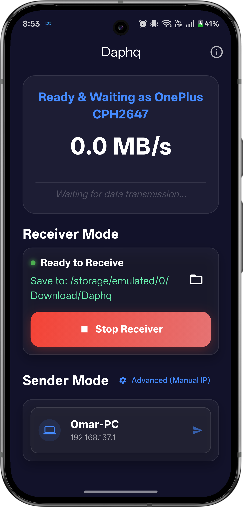
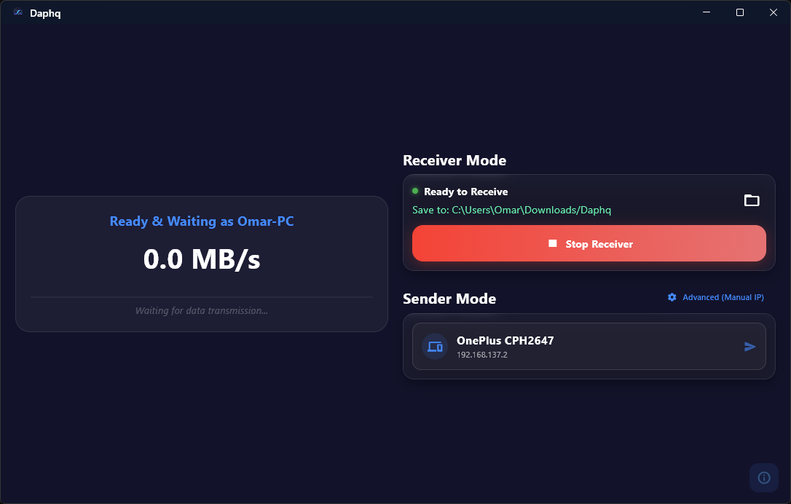

<p align="center">
  
  <h1 align="center">Daphq</h1>
</p>

<p align="center">
  <b>Blazing Fast, Cross-Platform File Transfer Application over Local Wi-Fi & Hotspots.</b><br/>
  🌐 <b>Official Website: <a href="https://omarafifi-cse.github.io/daphq/">omarafifi-cse.github.io/daphq/</a></b><br/>
  Developed by <b>Omar Afifi</b>
</p>

<p align="center">
  <a href="#%EF%B8%8F-core-architecture">Architecture</a> •
  <a href="#-performance--networking-efficiency">Performance</a> •
  <a href="#-key-features">Features</a> •
  <a href="#-under-the-hood-technical-audit-highlights">Under The Hood</a> •
  <a href="#-license">License</a>
</p>

---

## 🚀 Introduction

**Daphq** is a robust, cross-platform file transfer utility engineered to deliver unparalleled speed and reliability over local area networks (LAN), Wi-Fi, and Mobile Hotspots. With the release of **v2.0.0**, Daphq introduces a completely rebuilt discovery engine and advanced sharing capabilities. Designed with performance and low-level network optimization in mind, Daphq bypasses the bloated overhead of conventional HTTP-based transfers, utilizing raw TCP streams to push network hardware to its absolute limits.

Whether you're syncing massive folders across your devices or sharing gigabytes of data on the fly, Daphq ensures a seamless, memory-efficient, and secure operation.

## 🏗️ Core Architecture

Daphq is built with a modern, reactive, and highly scalable architecture:

- **Framework**: Developed using **Flutter (Dart)** for true cross-platform compatibility (Currently: Android, Windows).
- **State Management**: Implements the **BLoC (Business Logic Component) / Cubit** pattern (`flutter_bloc`). This cleanly decouples the UI from complex network logic, ensuring the application remains highly responsive even under intense data loads.
- **Background Execution**: Leverages `flutter_foreground_task` on Android to maintain uninterrupted background data synchronization, strictly adhering to modern Android 14/15 Foreground Service data-sync requirements.
- **Network Discovery**: A custom-built UDP discovery service that actively monitors connectivity, caches IPs, and uses a watchdog mechanism for instant recovery during IP changes or network dropouts.
- **Window Management**: Uses `window_manager` for native-feeling desktop experiences, providing flicker-free layouts and optimal UX on desktop environments.

## ⚡ Performance & Networking Efficiency

Daphq achieves its "Gold-Standard" speed through a meticulously crafted network layer. Instead of relying on heavy HTTP requests or third-party wrappers, Daphq communicates via bare-metal **TCP Sockets** (`Socket` & `ServerSocket`).

### 1. Zero HTTP Overhead & TCP Optimization
Daphq uses pure TCP connections with `SocketOption.tcpNoDelay` enabled. This disables Nagle's algorithm, eliminating artificial latency and ensuring packets are dispatched the microsecond they are ready. 

### 2. Intelligent Memory & Buffer Management
To prevent Out-Of-Memory (OOM) exceptions and GC (Garbage Collection) pauses during multi-gigabyte transfers:
- **Chunked Data Streaming**: Files are read and transmitted in memory-safe chunks.
- **Dynamic Buffer Flushing**: The sender controller implements a rigid flush threshold (`await socket.flush()`). It tracks `bytesBuffered` and periodically flushes the TCP socket, ensuring the device's RAM is never overwhelmed by asynchronous backpressure.
- **Header Limits**: JSON metadata headers are strictly capped at 1MB to prevent malicious memory exhaustion attacks before the transfer even begins.

### 3. Exact Boundary Precision Disk I/O
When receiving continuous streams of multiple files, Daphq avoids allocating intermediate buffers. The receiver slices the incoming `Uint8List` using `sublistView` with exact mathematical boundary precision:
```dart
currentSink.add(Uint8List.sublistView(chunk, offset, offset + bytesNeeded));
```
This guarantees zero-copy byte slicing and atomic file writes, drastically reducing CPU overhead during high-speed I/O.

### 4. Real-World Benchmarks & Hardware Saturation

Daphq's performance has been rigorously tested to ensure it pushes hardware to its physical limits:

- **Wi-Fi 5 (802.11ac) 5GHz Hotspot** *(Negotiated at 866 Mbps Link)*: 
  Consistently saturates the maximum physical bandwidth, peaking at **80 - 85 MB/s**.
  - **Efficiency**: Achieves an astounding **~93% effective throughput** of the raw physical link.
  - **Zero Overhead**: Bypasses the heavy lifting of standard HTTP/REST implementations, utilizing raw TCP streaming for near-zero protocol overhead.

> **Got Wi-Fi 6/7?** Daphq's raw socket architecture is future-proof and will scale linearly with hardware.

## ✨ Key Features

- **Extreme Throughput (TCP)**: Bypasses HTTP/REST overhead using raw TCP sockets with `tcpNoDelay` for near-zero protocol latency (Speeds up to 100+ MB/s).
- **System-Wide Sharing**: Share files directly from any app. Includes native **Android Share Menu** integration and a **Windows Context Menu** ("Send via Daphq") shell extension for seamless desktop file sharing.
- **Atomic Directory Sync**: Recursively traverse and reconstruct exact directory trees with intelligent collision management and auto-renaming.
- **Batch Transfer Support**: Select, stage, and transfer multiple files or entire directories simultaneously with a single click.
- **Smart Discovery Engine**: Connectivity-aware engine with instant watchdog recovery and IP caching for near-instant device pairing.
- **Uninterruptible Background Sync**: (Android) Foreground Services keep transfers alive even when the app is closed or the screen is off.
- **Secure Authorization**: Receivers have full control—view the payload size and file count before explicitly authorizing any transfer.
- **Advanced Analytics & ETA**: Precise real-time tracking of transfer speeds (MB/s), total payload progress, and estimated time remaining.

## 📸 Screenshots

| Android UI | Windows Desktop UI |
| :---: | :---: |
|  |  |
| *Clean, robust mobile layout with background service tracking.* | *Responsive desktop experience.* |

## 🔬 Under the Hood (Technical Audit Highlights)

A deep dive into Daphq's source code reveals several advanced optimizations:
- **Responsive Protocol**: The custom application-layer protocol consists of a lightweight JSON header (specifying file names, recursive paths, and byte sizes) followed instantaneously by raw binary data.
- **Concurrency & Completers**: Utilizes `Completer` heavily to orchestrate asynchronous socket events (e.g., waiting for receiver authorization or ensuring background disk writes finalize before terminating connections).
- **Graceful Error Handling & OS Mapping**: Platform-specific `SocketException` codes (e.g., OS Error 111, 10061, 104) are intercepted and translated into user-friendly diagnostics, eliminating cryptic crashes.
- **Auto-Renaming Collision Handling**: Protects existing data. If a file collision occurs, Daphq automatically safely renames incoming data (e.g., `file (1).txt`) recursively.

## 📄 License

This project is licensed under the MIT License - see the [LICENSE](LICENSE) file for details.

Copyright (c) 2026 Omar Afifi
